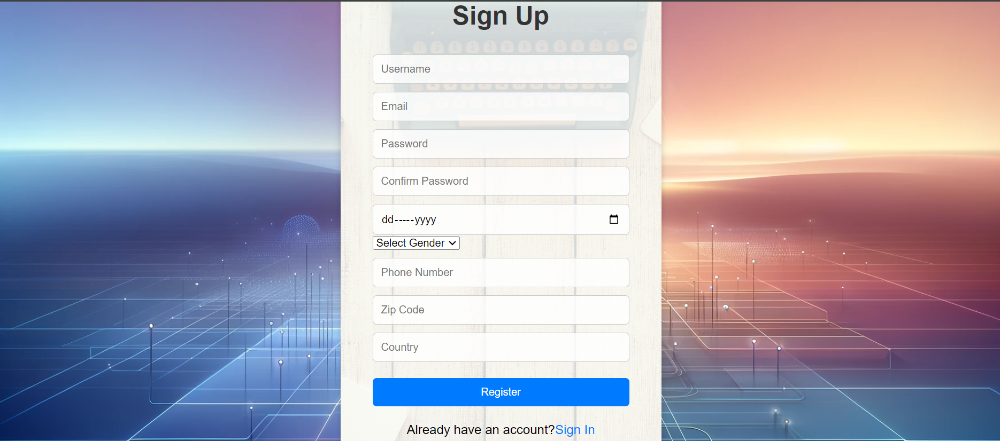

# Task 1: Landing Page

## Description
This landing page project aims to demonstrate proficiency in HTML and CSS3 by creating a simple yet visually appealing webpage. It consists of several sections, including a navbar, hero section, and footer.

## Sections

### Navbar
- The navbar contains a logo and links to all pages.
- CSS Pseudo-classes are applied for hover, visited, and active links to enhance user experience.

### Hero Section
- The hero section incorporates a picture and text.
- Flex property is utilized for layout, allowing for flexible and responsive design.

### Footer
- The footer contains website information and links to social media platforms.

## Preview
*Header section example*

*Hero section example*

*Footer section example*

## Usage
To view the landing page, open the `index.html` file in a web browser.

# Task 2: Sign-in and Sign-up Pages

## Description
This project involves designing separate sign-in and sign-up pages with comprehensive styling using HTML and CSS.

## Screenshots
Sign-In Page

Sign-Up Page

## Usage
Open the `index.html` files for the sign-in and sign-up pages in a web browser to view them.

## Credits
This project was created by Husnain Mahmood.