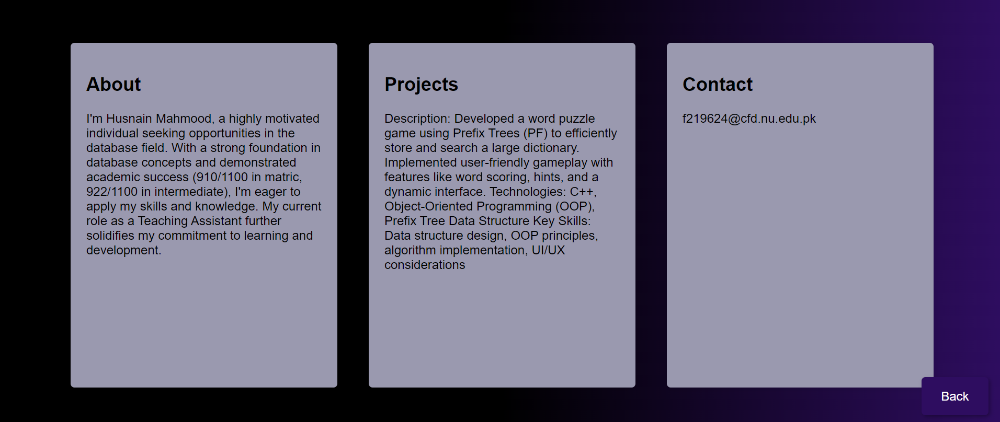
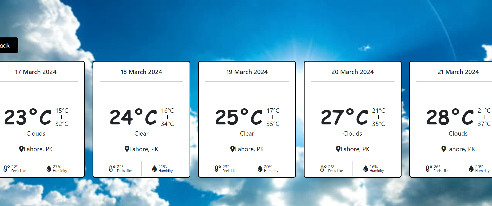

# Web-Assignment-2
I am doing a web assignment in which i have assigned to do all my assignment on Git Hub.

# Portfolio Project

This repository contains the completion of various tasks as part of a portfolio project. Each task is outlined below along with a brief description and screenshots of the completed work.

## Task 1: Personal Portfolio (40 Marks)
- Developed a professional portfolio showcasing skills, projects, and experiences.
- Structured the portfolio for easy presentation to potential employers.
- Utilized technologies such as HTML, CSS, and JavaScript.
- Hosted the portfolio on GitHub Pages.
- Live link to the portfolio: [Portfolio Link](#) <!-- Add your live portfolio link here -->

## Task 2: Weather App (20 Marks)
- Created a weather application using HTML, CSS, JavaScript, and jQuery.
- Implemented city search, current conditions, a 5-day forecast, and responsive design.
- Utilized OpenWeatherMap API for fetching weather data.
- Link for API: [OpenWeatherMap API](https://openweathermap.org/api/)

## Task 3: Digital Clock App (20 Marks)
- Developed a Digital Clock UI using HTML, CSS3, and jQuery.
- Included real-time functionality for hours, minutes, and seconds.
- Styled the clock for a modern look using CSS3.

## Task 4: Rock Paper Scissor Game (20 Marks)
- Created a Rock, Paper, Scissors game using HTML, CSS, JavaScript, and jQuery.
- Supported single-player mode against the computer.
- Validated user choices and included a scoring mechanism.

Feel free to explore each task for more details. Your feedback is appreciated!

## Credits
This assignment was implemented by Husnain Mahmood.

## Conclusion
This practice exercise demonstrates the effectiveness of Bootstrap in improving the visual appeal and responsiveness of web pages. By leveraging Bootstrap's pre-built components and grid system, developers can create professional-looking websites with ease. Further exploration of Bootstrap's features can lead to even more sophisticated web designs.
