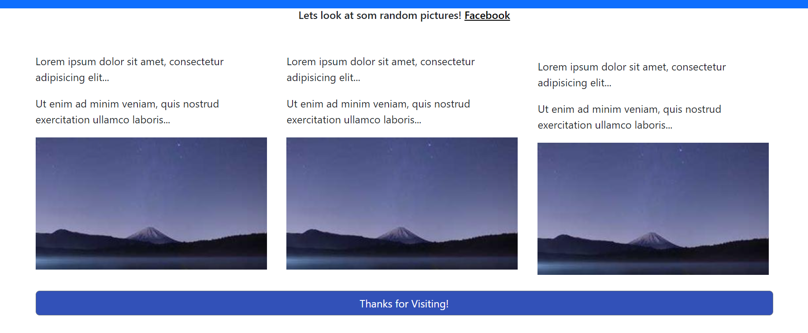

# Task 1: Git Hub repo

# Task 2: JavaScript form validation
## Description
Task 2 involves implementing form validation using JavaScript for the sign-in and sign-up forms.

## Implementation Details
Identified required fields.
Validated input format and type.
Checked input data length.
Validated numeric input.
Validated date input.
Used pattern matching with regular expressions.
Provided clear error messages.

## Testing
Thoroughly tested the validation process to ensure effectiveness.

## Screenshots
Sign-In Page

Sign-Up Page

## Usage
Open the HTML files for the sign-in and sign-up pages in a web browser. Ensure JavaScript is enabled for validation to work properly.

# Task 3: Bootstrap practice
# Bootstrap Practice Repository Report

## Overview
This repository contains a practice exercise demonstrating the implementation of Bootstrap in a basic HTML document. Bootstrap, a popular CSS framework, was utilized to enhance the layout and styling of the webpage.

## Changes Made
- Integrated Bootstrap CSS and JavaScript files from CDN for styling and functionality.
- Styled the header section using `.container-fluid`, `.bg-primary`, `.text-white`, and `.text-center` classes.
- Utilized Bootstrap's grid system with `.row` and `.col-sm-4` classes to organize content into responsive columns.
- Incorporated placeholder images with Bootstrap's responsive image class.
- Styled call-to-action buttons using Bootstrap button classes.

## Screenshots
BootStrap Practice 

## Usage
To view the practice webpage, simply open the HTML file in a web browser.

## Credits
This project was implemented by Husnain Mahmood.

## Conclusion
This practice exercise demonstrates the effectiveness of Bootstrap in improving the visual appeal and responsiveness of web pages. By leveraging Bootstrap's pre-built components and grid system, developers can create professional-looking websites with ease. Further exploration of Bootstrap's features can lead to even more sophisticated web designs.
