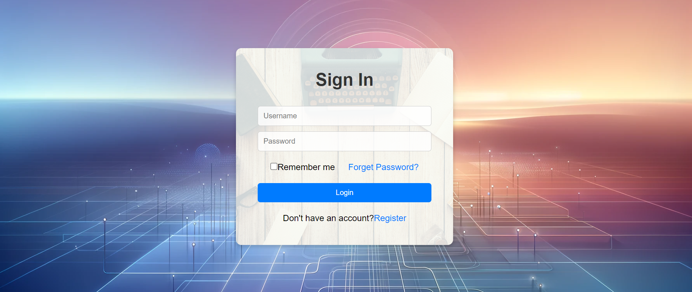
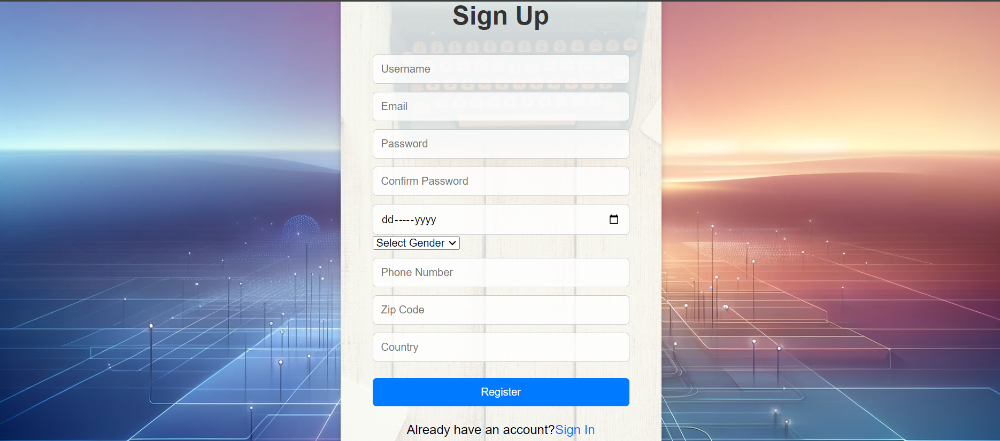

# Task 2: Sign-in and Sign-up Pages

## Description
This project involves designing separate sign-in and sign-up pages with comprehensive styling using HTML and CSS.

## Screenshots
*Sign-In Page*

*Sign-Up Page*

## Usage
Open the `index.html` files for the sign-in and sign-up pages in a web browser to view them.

## Credits
This project was created by Husnain Mahmood.

## License 
This project is licensed under the [MIT License](LICENSE).
